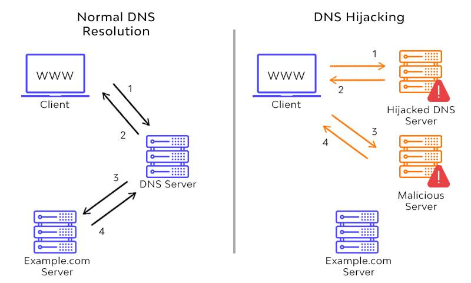

## Instructions

1. Research major cybersecurity breaches over the past 20 years and pick one to write a short essay on.

2. Give an overview of what the breach was and the motivations behind it.

3. Explain where the “tech flaws” were, and how hackers were able to breach their system.

4. What has the company done to protect against that vulnerability since?

## Research

SUS DNS hijacking

The brazilian SUS, a government-run public health care system, digital infrastructure suffered a malicious attacked authored by Lapsus$ Group in December 2021. Supposedely, 50 TB of data were copied and stolen from its systems, including information of the national imunization program, that holds all brazilians's Covid-19 vaccine certificates. People couldn't access their vaccination certificates for a couple of days, while the systems were out.

Specialists believe it suffered a DNS hijacking attack, that happens when a DNS gets stolen and traffic is redirected to a compromised server.

According to (Wallarm)[https://www.wallarm.com/what/what-is-dns-hijacking-basic-methods-of-protection], DNS hijacking can be achievied through 4 different ways:

1. Local DNS Hijack: This DNS hijacking method is achieved when a cybercriminal installs a Trojan malware on a website user’s computer. This malware is built to disguise as a legitimate software. Once it is active, it gives hackers access to the network systems in use and allows them to steal data and alter DNS settings to redirect users to fake websites.

2. Router DNS Hijack: This DNS hijacking method involves hackers using a vulnerable DNS router (a hardware device used by domain service providers to link their domain names to equivalent IP addresses) to launch a DNS attack by overriding and reconfiguring the router’s DNS settings. Once this is done, the attackers jam the website then redirect traffic to another malicious website, making the website inaccessible to users.

3. Man-in-the-middle DNS Hijack: This is done by hackers operating within the communication between a network user and a DNS server to obstruct such communication and eventually redirect the user to an unknown destination IP address leading to harmful websites. It is also referred to as DNS spoofing.

4. Rogue DNS Hijack: This involves an attacker hacking the DNS server, altering its saved records, and redirecting subsequent DNS queries to malicious websites usually owned by them.